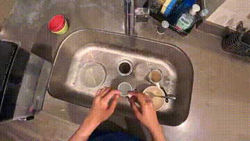
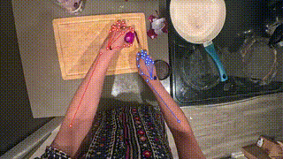
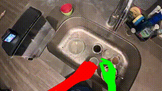
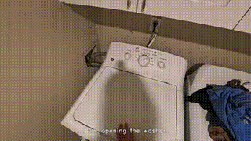

# Ego Homes

Ego Homes is a first-person dataset of everyday household activities captured in
native home environments. Using head-mounted and body-worn cameras, we record
unscripted interactions across the entire home — kitchen, laundry, living spaces —
annotated with hand pose, segmentation, and action labels.

## HomeHands-50

The core dataset: egocentric RGB footage of everyday household activities captured
from a first-person wearable camera.

| | |
|---|---|
| Hours | 50 |
| Videos | 2,700 |
| Frames | 5.4M |
| Tasks | 25 |
| Action classes | 100 |
| Narrations | 7,600 |
| Hands tracked | 1.8M |
| Segmentation masks | 8.9M |

Example activities: washing a cup, cutting a banana, folding clothes, making tea,
mopping, sweeping, arranging shoes, pouring water, and more.

## Derived Datasets

Each derived dataset adds a different layer of annotation on top of the raw
HomeHands-50 footage, generated by running the recordings through our processing
pipeline.

### HomeTrace — Hand Tracking

A 21-point hand skeleton (wrist, knuckles, and fingertips) is tracked per frame for
both hands using MediaPipe HandLandmarker, giving x, y, z coordinates for every
keypoint across the clip.

### HomeMask — Segmentation

Per-frame instance masks for hands, objects, and surfaces, produced with a
fine-tuned segmentation model across all activity clips. Masks are saved as binary
PNGs across 20 object/surface classes.

### HomeVoice — Audio Narration

Live-narrated recordings where the person performing each task describes their own
actions in real time, with burned-in captions and accompanying SRT subtitle files.

### HomeDepth — Depth Maps

Per-frame monocular depth maps estimated from the RGB footage, capturing spatial
layout and object distances for each activity clip (16-bit PNG, coming soon).

## Contact

Questions about the dataset, pipeline, or collaboration: **aneessaheba04@gmail.com**
